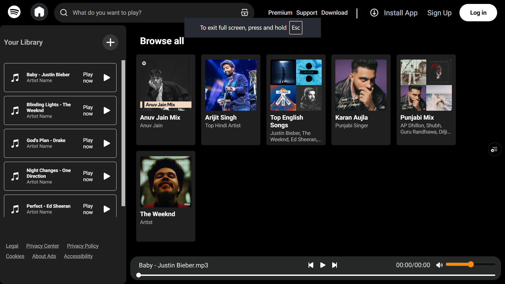

# 🎵 Spotify Clone

A responsive Spotify-inspired music player built using HTML, CSS, and JavaScript.

## 🚀 Live Demo

https://spotify-clone-eight-eta-63.vercel.app/

## 📸 Preview



## ✨ Features

- 🎶 Play and pause songs
- ⏮️ Previous and Next controls
- 📂 Multiple playlists
- 🎵 Dynamic song loading using JSON
- 📱 Responsive design
- 🍔 Mobile sidebar with hamburger menu
- 🔊 Volume control
- ⏱️ Seek bar with current time and duration
- 🎧 Beautiful Spotify-inspired UI

## 🛠️ Technologies Used

- HTML5
- CSS3
- JavaScript (ES6)
- Git & GitHub
- Vercel

## 📂 Project Structure

```
Spotify-Clone/
│
├── img/
├── songs/
│   ├── English/
│   ├── Punjabi/
│   ├── Anuv Jain/
│   ├── Arijit Singh/
│   ├── Karan Aujla/
│   ├── The Weeknd/
│   └── playlists.json
│
├── index.html
├── style.css
├── script.js
└── README.md
```

## ⚙️ Installation

1. Clone the repository

```bash
git clone https://github.com/karthiksiripuram/Spotify-Clone.git
```

2. Open the project folder.

3. Run using Live Server or any local server.

## 📌 Future Improvements

- ❤️ Favorite Songs
- 🔀 Shuffle Mode
- 🔁 Repeat Mode
- 🔍 Search Songs
- 🎤 Artist Information
- 🎵 Playlist Creation

## 👨‍💻 Author

**Karthik Siripuram**

GitHub: https://github.com/karthiksiripuram